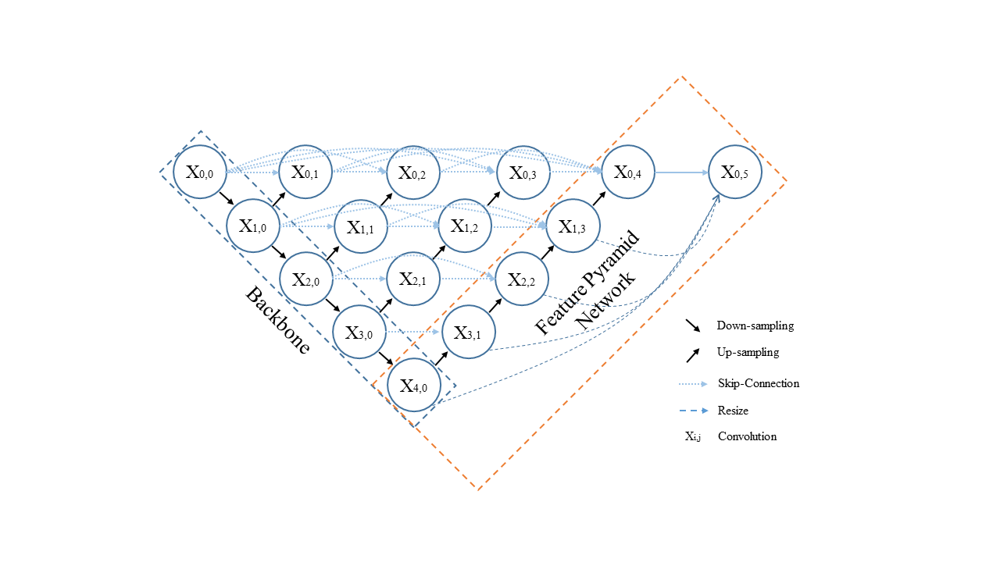

# Code for "A Deep Learning-based Method to Extract Lumen and Media-Adventitia in Intravascular Ultrasound Images
** This paper has been published in Ultrasonic Imaging: https://doi.org/10.1177/01617346221114137
Please read the paper for more details.

Intravascular ultrasound (IVUS) imaging allows direct visualization of the coronary vessel wall and is suitable for assessing atherosclerosis and the degree of stenosis. Accurate segmentation and lumen and median-adventitia (MA) measurements from IVUS are essential for such a successful clinical evaluation. However, current automated segmentation by commercial software relies on manual corrections, which is time-consuming and user-dependent. We aim to develop a deep learning-based method using an encoder-decoder deep architecture to automatically and accurately extract both lumen and MA border. Inspired by the dual-path design of the state-of-the-art model IVUS-Net, our method named IVUS-U-Net++ achieved an extension of the U-Net++ model. More specifically, a feature pyramid network was added to the U-Net++ model, enabling the utilization of feature maps at different scales. Following the segmentation, the Pearson correlation and Bland-Altman analyses were performed to evaluate the correlations of 12 clinical parameters measured from our segmentation results and the ground truth. A dataset with 1746 IVUS images from 18 patients was used for training and testing. Our segmentation model at the patient level achieved a Jaccard measure (JM) of 0.9080 ± 0.0321 and a Hausdorff distance (HD) of 0.1484 ± 0.1584 mm for the lumen border; it achieved a JM of 0.9199 ± 0.0370 and an HD of 0.1781 ± 0.1906 mm for the MA border. The 12 clinical parameters measured from our segmentation results agreed well with those from the ground truth (all p-values are smaller than .01). Our proposed method shows great promise for its clinical use in IVUS segmentation.

Figure 1.  The architecture of our deep neural network IVUS-U-Net++ incorporates two parts. One is the U-net++ network, which leads to a highly flexible feature fusion scheme to integrate different-scale features from different-depth encoder layers. The other is the feature pyramid network, which is able to synthesize multiscale feature maps to the final output from different-depth decoder layers. Of note, upscale operators are adopted to ensure size compatibility of the feature maps during the fusion of multiscale features. Our goal is to enhance the multiscale feature representation and fusion.




### Note
We trained the models on a Linux machine equipped with a single Tesla P100 GPU with 16 GB GPU memory. Our method was implemented by Keras 2.2.24 with Cuda 9.0.


### 1. Architecture of the data dolder
- data
     - subject/train/*.jpg : all slices are stored in a separate folder.
     - subject/lumen/*_lumen.png : png images are binary labels for lumen ROIs.
     - subject/MA/*_MA.png : png images are binary labels for MA ROIs.
- "*" represent the id or other sequence marker to keep the files in the same order.

### 2. Segmentation model training
Commands for training:
```
# Code for training IVUS-Net++
python VESSEL_application5.py 
  --mode="lumen" \
  --data_path=/data \
  --n_workers=6 \
  --cv=0 \
  --cv_max=5 \
  --train=True \
  --validate_epoch=100 \
  --gpu=0 \
  --image_size=512 \
  --backbone= "inceptionresnetv2" \  
```

